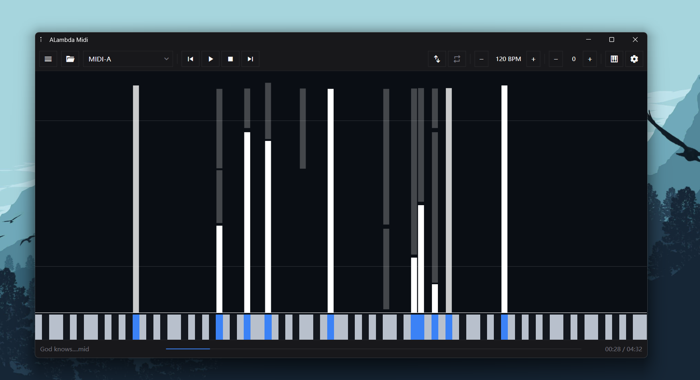
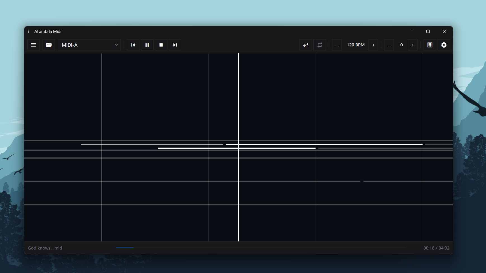
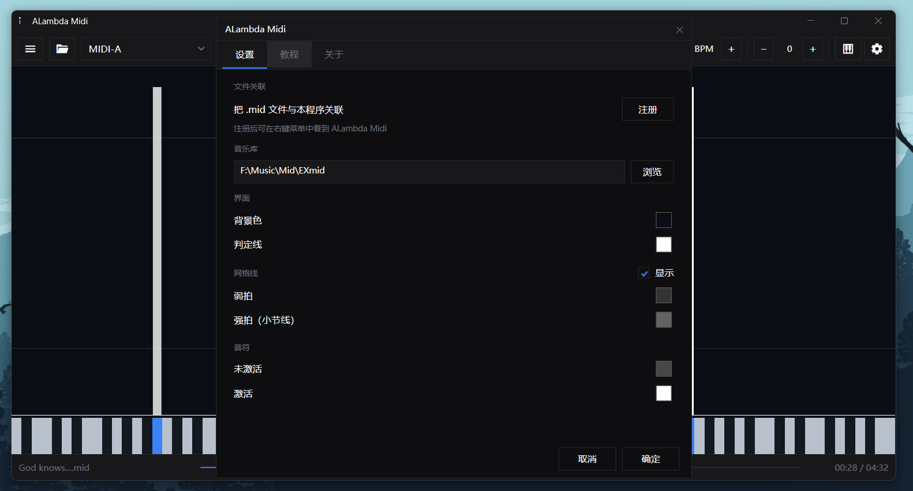
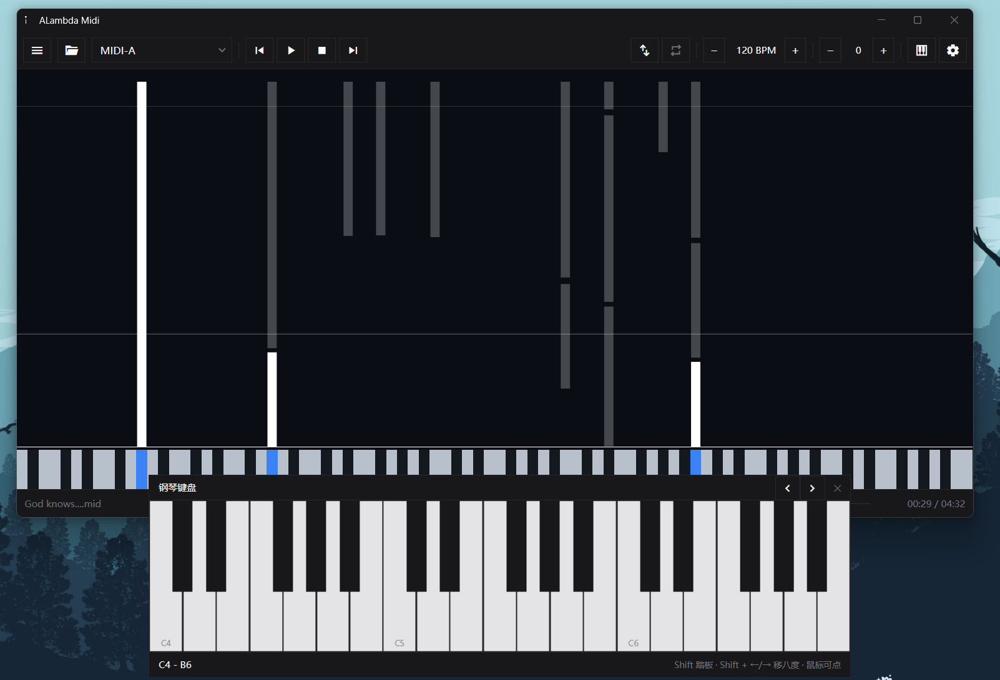
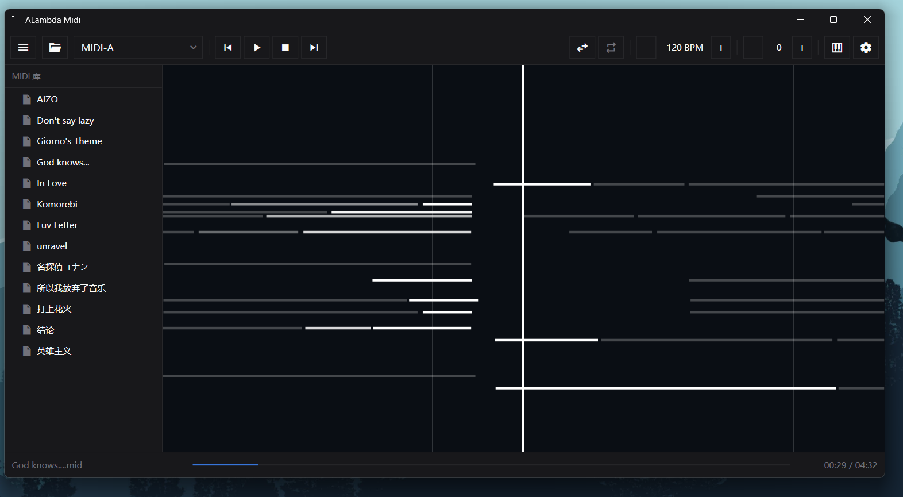

# 简单易用又现代好看的 MIDI 播放 / 可视化软件!

你是否也受够了那些 800 年前的 midi 播放器老旧的界面, 又丑又复杂的 UI ? 你是否也经常苦恼为何 midi 播放器不能使用你更优秀的软音源如 Keyscape, Pianoteq ? 你是否还在找能够同时拥有 播放 midi, 发送 midi, 电脑键盘转 midi 信号, midi可视化的软件? 今天这个软件就是为解决这个问题而诞生的!

**ALambda Midi v1.0**, 一个 MIDI 播放器 + 实时可视化工具，支持发送 MIDI 信号到外部音源（如 Pianoteq、DAW、Microsoft GS Wavetable Synth）

  

---

## 界面预览

### 竖版瀑布流

音符从上方落下，底部是钢琴键盘。音符碰到判定线的瞬间开始播放。

  

### 横版卷轴

音符从右向左移动，中间是判定线。适合喜欢简洁风格的用户。

  

### 设置界面

颜色、音乐库、文件关联全部在这里配置。

  

### 钢琴键盘

电脑键盘映射成 MIDI 键盘，支持鼠标点击、滑奏、Shift 踏板、八度切换。

  

---

## 功能特性

### 播放与 MIDI 发送

- 打开 `.mid` / `.midi` 文件，发送 MIDI 信号到任意系统输出端口
- 自动枚举所有可用 MIDI 端口（Pianoteq、DAW、loopMIDI、Microsoft GS Wavetable Synth 等）
- 播放 / 暂停 / 恢复 / 停止
- 进度条可点击或拖动跳转
- BPM 实时调节（不影响音高）
- 移调 ±12 半音（不影响速度）
- 循环模式：无 / 列表循环 / 随机

### 实时可视化

- **竖版瀑布**：音符下落，底部钢琴键盘参考
- **横版卷轴**：音符从右向左，中间判定线
- 音符碰到判定线时高亮，保持 0.5 秒后淡出
- 节拍网格线（随 MIDI 拍号自动变化）
- 流速可调（通过修改源码常量）

### 音乐库

- 在设置中指定一个文件夹作为 MIDI 库
- 侧边栏树形浏览，支持子文件夹
- 上一首 / 下一首
- 循环模式：无 / 列表 / 随机

  

### 钢琴键盘

- 电脑键盘映射（FL Studio 风格）
- 低八度：`Z S X D C V G B H N J M , L . ; /`
- 高八度：`Q 2 W 3 E R 5 T 6 Y 7 U I 9 O 0 P [ = ] \`
- 鼠标点击、按住拖动滑奏
- Shift 踏板
- Shift + ←/→ 切换八度（范围 C0 ~ B7）
- 白键上标注 C 音名

### 颜色自定义

- 背景、判定线、网格线（弱拍 / 强拍）、音符（激活 / 未激活）全部可配
- 内置 HSV 颜色选择器（色相环 + SV 正方形 + 滑条 + Hex 输入 + 预设色块）
- 所有颜色保存在 `%AppData%\ALambda Midi\config.json`，可手工编辑

### 文件关联

- 在设置中一键注册 `.mid` / `.midi` 文件关联
- 注册后可在右键菜单中看到 ALambda Midi
- 支持通过右键“用 ALambda Midi 打开”直接加载文件

---

## 快捷键

| 快捷键 | 功能 |
|---|---|
| `空格` | 播放 / 暂停 |
| `Alt` + `空格` | 停止 |
| `←` / `→` | 上一首 / 下一首 |
| `↑` / `↓` | 升调 +1 / 降调 -1 |
| `Ctrl`（单击） | 打开文件 |
| `Shift`（单击） | 横版 / 竖版切换 |
| `Esc` | 打开设置 |

---

## 安装

### 方式一：安装版（推荐）

1. 从 Releases 下载 [`ALambdaMidi_Setup_v1.0.exe`](https://github.com/Anming1379/ALambda-Midi/releases/download/v1.0/ALambdaMidi_Setup_v1.0.exe)
2. 双击运行，按提示完成安装
3. 安装程序会自动检测 .NET 10 桌面运行时，未安装则引导下载

### 方式二：便携版

1. 从 Releases 下载 [`ALambdaMidi_Portable_v1.0.exe`](https://github.com/Anming1379/ALambda-Midi/releases/download/v1.0/ALambdaMidi_Portable_v1.0.exe)
2. 双击运行，无需安装
3. 需要系统已安装 .NET 10 桌面运行时

---

## 系统要求

- Windows 10 1809 或更高版本（推荐 Windows 11）
- .NET 10 桌面运行时（[下载](https://dotnet.microsoft.com/download/dotnet/10.0/runtime)）
- 外部 MIDI 音源（如 Pianoteq、DAW、或系统自带的 Microsoft GS Wavetable Synth）

---

## 使用教程

### 快速开始

1. 打开 ALambda Midi
2. 从工具栏下拉框选择 MIDI 输出端口（如 `Microsoft GS Wavetable Synth` 或 `Pianoteq`）
3. 点击“打开”按钮或按 `Ctrl`，选择 `.mid` 文件
4. 按 `空格` 播放

### 设置音乐库

1. 按 `Esc` 打开设置
2. 在“音乐库”区域点击“浏览”，选择一个包含 MIDI 文件的文件夹
3. 点击“确定”，侧边栏会列出该文件夹及子文件夹中的所有 MIDI 文件
4. 点击侧边栏中的文件即可加载并播放

### 注册文件关联

1. 按 `Esc` 打开设置
2. 在“文件关联”区域点击“注册”
3. 之后右键 `.mid` 文件 → 打开方式 → 选择 ALambda Midi
4. 勾选“始终使用”后，双击 `.mid` 文件即可用 ALambda Midi 打开

### 虚拟 MIDI 接口

如果你想使用 ALambda Midi 配合外部音源（如 Pianoteq、Keyscape 等），需要创建一个虚拟 MIDI 接口。它相当于一根“软件内的 MIDI 线”，把 ALambda Midi 发出的 MIDI 信号“连接”到音源软件。

> **注意**：Windows 自带的 `Microsoft GS Wavetable Synth` 不需要虚拟 MIDI 接口，直接在下拉框选择它就能出声。虚拟 MIDI 接口仅在连接第三方音源时使用。

#### Windows 10：使用 loopMIDI

1. 前往 [loopMIDI 官网](https://www.tobias-erichsen.de/software/loopmidi.html) 下载并安装 loopMIDI
2. 启动 loopMIDI，在底部文本框输入端口名称（例如 `ALambda Midi`），点击左下角的 `+` 按钮创建端口
3. 创建完成后，**保持 loopMIDI 在后台运行**（可最小化到托盘）
4. 打开你的音源软件（如 Pianoteq），在 MIDI 输入设置中选择刚才创建的 `ALambda Midi` 端口
5. 回到 ALambda Midi，在输出端口下拉框中选择同一个 `ALambda Midi` 端口
6. 现在播放 MIDI 时，声音就会由你的音源软件发出

#### Windows 11：使用 Windows MIDI Services

Windows 11 内置了新一代的 MIDI 服务，它使用 **“环回端点对”（A/B 侧）** 来创建虚拟 MIDI 连接，不再像旧版那样只提供一个单一的环回端口[reference:1]。

**第一步：安装 Windows MIDI Services 运行时与工具**

1. 前往 [Windows MIDI Services Releases](https://github.com/microsoft/MIDI/releases/tag/rc-4) 页面
2. 下载并安装 `App SDK Runtime`（x64 版本）以及 `Tools` 包
3. 安装完成后，你的开始菜单中会出现 **MIDI Settings** 应用

**第二步：创建一个环回端点对**

1. 打开 **MIDI Settings** 应用
2. 在顶部工具栏中点击 **Loopback Setup**
3. 在 **MIDI 2.0 Loopbacks** 区域，点击 **New loopback**
4. 输入一个基础名称（例如 `ALambda Midi`）。系统会自动创建两个端点：`ALambda Midi (A)` 和 `ALambda Midi (B)`[reference:2]
5. 点击 **OK** 完成创建。这两个端点默认会持久化保存，重启后依然存在[reference:3]

**第三步：连接 ALambda Midi 与音源**

1. 打开你的音源软件（如 Pianoteq），在 MIDI 输入设置中选择 **`ALambda Midi (B)`** 端口
2. 回到 ALambda Midi，在输出端口下拉框中选择 **`ALambda Midi (A)`** 端口
3. 这样，ALambda Midi 从 A 侧发出的信号，就会从 B 侧进入你的音源软件[reference:4]
4. 播放 MIDI，音源软件就会出声

> **提示**：如果你更习惯传统的单一端口模式，Windows MIDI Services 也提供了 **“MIDI 1.0 Basic Loopback”**。你可以在 Loopback Setup 页面切换到 **MIDI 1.0** 标签，创建一个“基础环回”，它会像 loopMIDI 一样，只生成一个名称的端口，在两端选择同一个名字即可[reference:5]。

---

## 关于

- **版本**：v1.0
- **作者**：Anming_cat
- **主页**：https://anmingcat.pages.dev/
- **仓库**：https://github.com/Anming1379/ALambda-Midi
- **协议**：MIT License
- **说明**：代码由 AI 生成

---

## 已知限制

- 不支持内嵌音源，需要外部 MIDI 设备或软件监听
- 部分全新的 Windows 11 系统可能没有 Microsoft GS Wavetable Synth，需自行安装音源
- 单文件发布（`--self-contained false`）需要用户预先安装 .NET 10 桌面运行时

---

## 协议

MIT License

---

## 致谢

- [DryWetMIDI](https://github.com/melanchall/drywetmidi) — MIDI 文件解析与播放
- [SkiaSharp](https://github.com/mono/SkiaSharp) — 跨平台 2D 绘图
- [Material Symbols](https://fonts.google.com/icons) — 界面图标